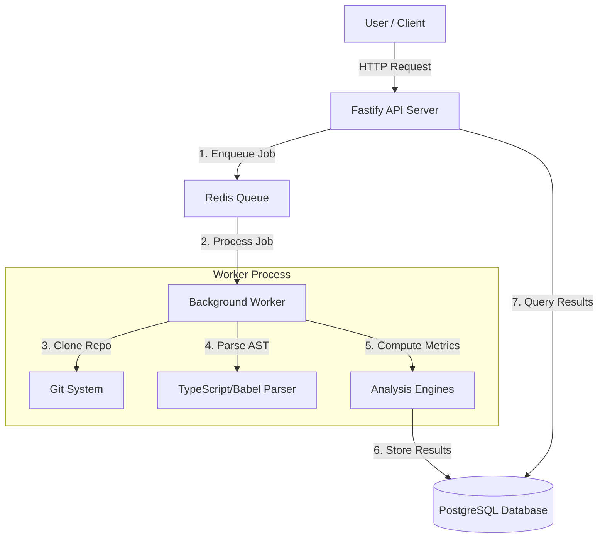

# 🏗️ System Architecture

Code Archaeology is built on a distributed architecture design to handle resource-intensive analysis tasks without blocking the main API.

## 🧩 Components

### 1. API Server (`server/src/index.ts`)
- **Framework**: Fastify v5
- **Role**: Handles HTTP requests, authentication, and job dispatching.
- **Key Routes**:
  - `POST /api/analysis`: Triggers a new analysis run.
  - `GET /api/repositories/:id/*`: Retrieves analyzed data (hotspots, timeline, etc.).
- **Security**: Implements Rate limiting (`@fastify/rate-limit`) and Helmet (`@fastify/helmet`).

### 2. Job Queue (BullMQ + Redis)
- **Role**: Decouples the heavy lifting of code analysis from the HTTP layer.
- **Flow**:
  1. API receives a repository URL.
  2. Creates a job in the `analysis` queue.
  3. Returns a `runId` immediately to the client.

### 3. Background Worker (`server/worker.ts`)
- **Role**: Consumes jobs from the queue and performs deep analysis.
- **Process**:
  1. **Clone**: Uses `git` to clone the target repository to a temporary workspace.
  2. **History Walk**: Iterates through Git commits to build a timeline of changes.
  3. **Complexity Analysis**: Parses source files to calculate Cyclomatic Complexity.
  4. **Hotspot Detection**: Correlates file complexity with change frequency.
  5. **Bus Factor**: Analyzes author contributions to identify key risk areas.
  6. **Storage**: Saves all metrics to PostgreSQL.

### 4. Database (PostgreSQL)
- **Schema**:
  - `repositories`: Stores repo metadata.
  - `analysis_runs`: Tracks status of analysis jobs.
  - `commits`: Stores individual commit data.
  - `file_metrics`: Stores complexity and churn data per file.
  - `hotspots`: Aggregated hotspot data.

## 🔄 Data Flow

1. **Ingestion**: User submits a repo URL.
2. **Processing**: Worker clones the repo and walks the AST of every source file.
3. **Aggregation**:
   - **Churn**: Additions/deletions per file per commit.
   - **Complexity**: Halstead metrics and Cyclomatic complexity.
   - **Coupling**: Which files change together (temporal coupling).
4. **Presentation**: Client polls for status and renders charts once complete.

## 🛠️ Key Technologies

- **Runtime**: [Bun](https://bun.sh) (for fast startup and TS support)
- **Queue**: [BullMQ](https://docs.bullmq.io/)
- **Analysis**: [TypeScript Compiler API](https://github.com/microsoft/TypeScript) (for AST parsing)
- **Storage**: [Supabase](https://supabase.com) (PostgreSQL)

## 🐳 Deployment Architecture

The system is containerized into two services:

1. **API Service**: Exposes port 3001. Publicly accessible.
2. **Worker Service**: No public ports. Connects to Redis/DB internally. Scalable independently based on load.
