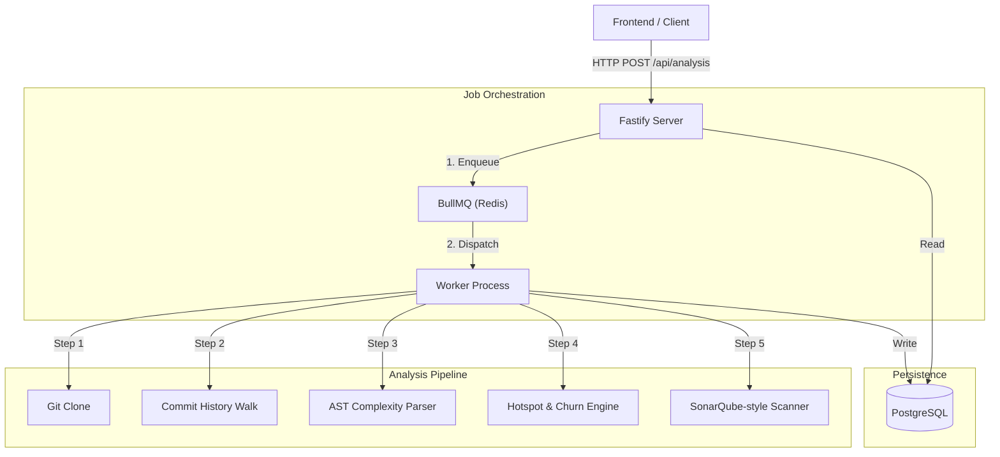

# 🏗️ Server Architecture

The Code Archaeology backend is a high-performance analysis engine designed to process Git repositories at scale. It uses a distributed job queue architecture to handle CPU-intensive tasks asynchronously.

---

## 📐 System Design



## 🧩 Core Components

### 1. API Gateway (`src/index.ts`)
- **Technology**: Fastify v5
- **Responsibility**: 
  - Validates incoming requests.
  - Generates `runId` for tracking.
  - Exposes REST endpoints for querying analysis results.
- **Middleware**:
  - `@fastify/rate-limit`: Prevents abuse (100 req/min).
  - `@fastify/helmet`: Sets secure HTTP headers.

### 2. Job Queue (`src/queue/analysis.ts`)
We use **BullMQ** on top of Redis to decouple the HTTP request from the actual processing.
- **Job Name**: `analyze`
- **Data Payload**: `{ runId, repoUrl, branch, options }`
- **Concurrency**: Scalable via adding more Worker instances (currently 1 per container).

### 3. Analysis Pipeline (`src/services/analysis.ts`)
The worker executes a strict sequence of engines. If any step fails, the job acts as a "Saga" and reports failure, but intermediate data may remain for debugging.

| Step | Engine | Description |
|------|--------|-------------|
| 1. **Ingestion** | `ingestRepository` | Clones repo to `./.data` and iterates commits to build the `commits` table. |
| 2. **File Metrics** | `computeFileMetrics` | Aggregates Lines Added/Deleted per file to calculate Churn vs. Velocity. |
| 3. **Ownership** | `computeOwnership` | Calculates "Bus Factor" by analyzing author distribution per file. |
| 4. **Complexity** | `computeComplexitySnapshots` | Parses source code (AST) at historical points to track debt trends. |
| 5. **Insights** | `generateInsights` | Runs heuristics (e.g., "God Class detection") on the computed metrics. |
| 6. **Quality** | `runQualityAnalysis` | Runs a static analysis pass (Sonar-like) on the *current* HEAD. |

### 4. Storage Layer (`src/db/schema.sql`)
- **PostgreSQL**: Relational data store for all structured metrics.
- **Repositories Table**: Single source of truth for a repo.
- **AnalysisRuns Table**: Tracks the status (`queued` -> `running` -> `succeeded` / `failed`) and timings.

---

## 📂 Directory Structure

```
server/src/
├── config/           # Environment variables (Zod schema)
├── db/               # SQL Schema & Connection logic
├── lib/              # Shared utilities (Git helpers, math)
├── queue/            # BullMQ producer/consumer definitions
├── routes/           # Fastify Route handlers
│   ├── analysis.ts
│   ├── health.ts
│   └── repositories.ts
└── services/         # Domain Logic (The Engines)
    ├── analysis.ts   # Pipeline Orchestrator
    ├── complexity.ts # Halstead/Cyclomatic Logic
    ├── ingestion.ts  # Git Interop
    ├── insights.ts   # Recommendation Engine
    ├── metrics.ts    # SQL Aggregations
    ├── ownership.ts  # Author Statistics
    └── quality.ts    # AST Static Analysis
```

## 🚀 Scaling Strategy

1.  **Horizontal Scaling**: The API and Worker are stateless. You can spin up 10 Workers to process 10 repositories in parallel.
2.  **Resource Isolation**: Workers handle `git clone` and AST parsing, which are CPU/IO heavy. Isolate them from the API to ensure UI responsiveness.
3.  **Redis Dependency**: Both API and Worker must share the same Redis instance to coordinate jobs.

## 🔐 Security

-   **Input Validation**: Strict regex on Repository URLs to prevent command injection.
-   **Isolation**: Each analysis runs in a temporary directory based on `runId` to prevent file collisions.
-   **Privileges**: The Docker container runs as a non-root `appuser`.
